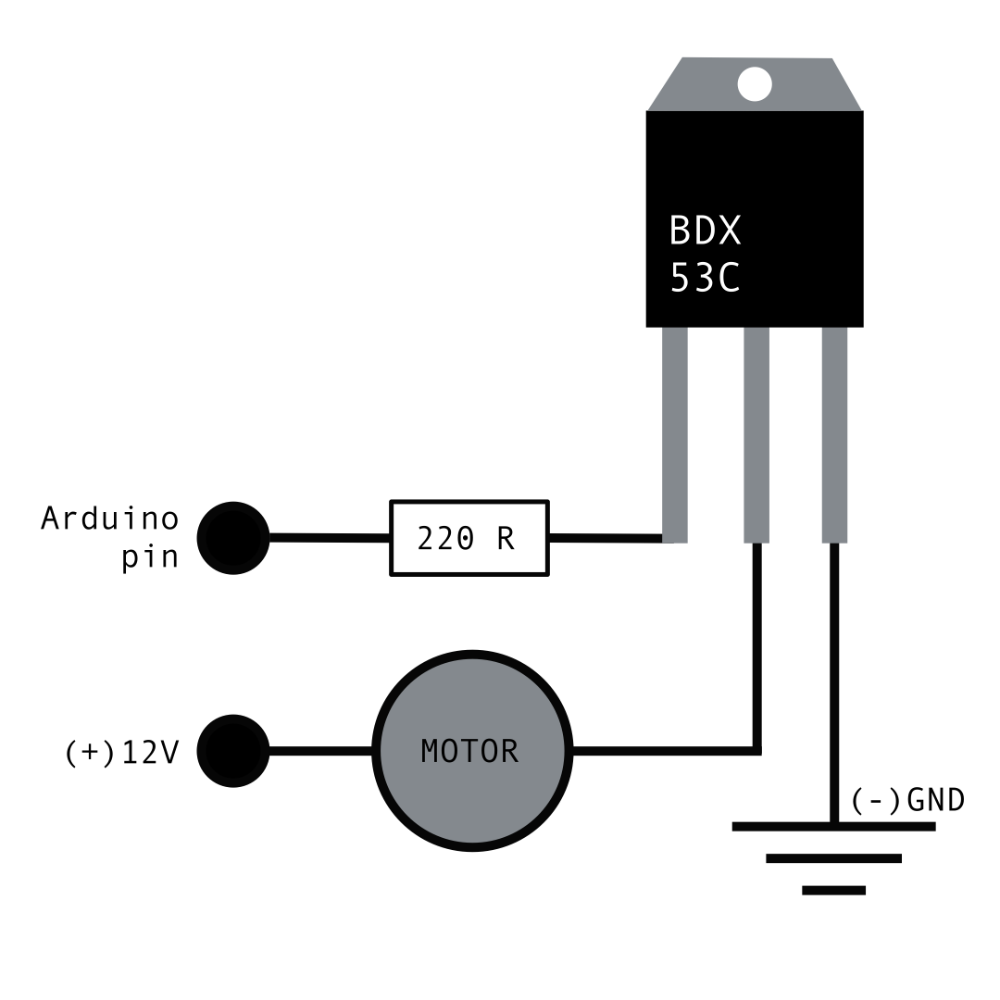

# Ritschratsch
 A framework for arduino to easily build sound machines from DC and servo motors, WS2812b led strips and trash. A lot of tape, zip ties and a glue gun is recommended.

### How to use? 
Ritschratsch can be used with any ATMega328 based microcontroller, an arduino nano is recommended though.
There are predefined outputs for servo motors, DC motors controlled through a L298N
H-bridge, a Neopixel style WS2812B LED strip and some general purpose outputs e.g. for single LED's, transistors or relays. All outputs (beside the one for the LED strip) can be programmed in a keyframe-ish way, which makes it quite easy to create even more complex patterns and behaviour.
Depending on the kind of output informations like ```interval duration``` ```motor speed``` ```target angle```etc. have to be provided, you can find more info about each output and how to use it in the example sketch.


### example circuit for a (darlington) transistor

### required  libraries
• FastLED  
• Servo

### CH340 driver for cheap arduinos
[MAC](https://github.com/adrianmihalko/ch340g-ch34g-ch34x-mac-os-x-driver)  
[WIN](http://www.wch.cn/download/CH341SER_ZIP.html)

### install ritschratsch library
1. download the folder from github via the green ```<> Code```button at the top right, select ```download zip```
2. unpack the zip file
3. copy the ```ritschratsch```folder to your local arduino libraries directory (usually at ```Documents/Arduino/libraries```)
4. restart the arduino IDE
5. navigate to ```File/examples/ritschratsch```and open the ```ritschratsch```example


### resources
[how to use a breadboard](https://computers.tutsplus.com/tutorials/how-to-use-a-breadboard-and-build-a-led-circuit--mac-54746)  
[what is an arduino?](https://learn.sparkfun.com/tutorials/what-is-an-arduino/all)  
[arduino download](https://www.arduino.cc/en/software)  
[arduino reference](https://www.arduino.cc/reference/en/)  
[L298D h-bridge](https://create.arduino.cc/projecthub/ryanchan/how-to-use-the-l298n-motor-driver-b124c5)  
[LED strips aka NeoPixel](https://learn.adafruit.com/adafruit-neopixel-uberguide?embeds=allow)
