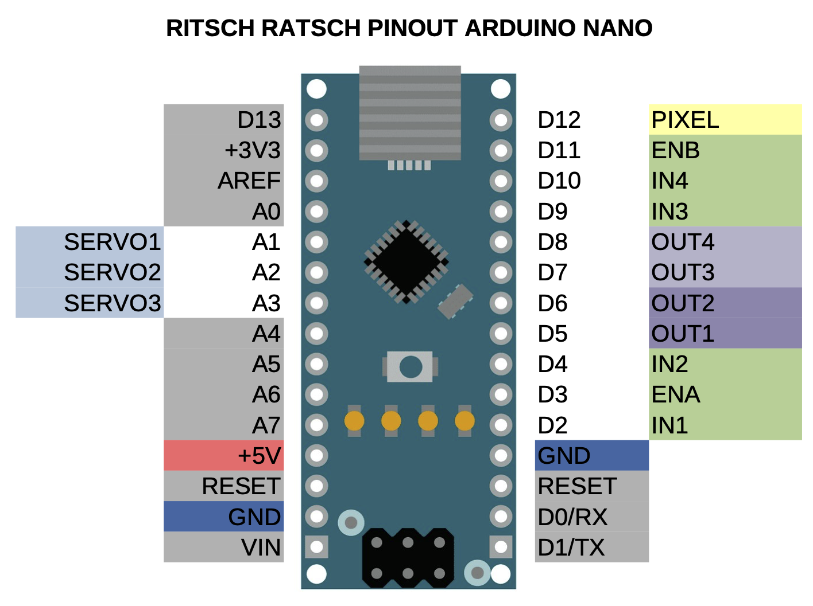

# Ritschratsch
 A framework for arduino to easily build sound machines from DC motors, servo motors, WS2812b led strips and trash.

### required additional libraries
• FastLED  
• Servo

### resources
[how to use a breadboard](https://www.sciencebuddies.org/science-fair-projects/references/how-to-use-a-breadboard)  
[what is an arduino?](https://learn.sparkfun.com/tutorials/what-is-an-arduino/all)  
[arduino download](https://www.arduino.cc/en/software)  
[arduino reference](https://www.arduino.cc/reference/en/)  
[L298D h-bridge](https://create.arduino.cc/projecthub/ryanchan/how-to-use-the-l298n-motor-driver-b124c5)  
[LED strips aka NeoPixel](https://learn.adafruit.com/adafruit-neopixel-uberguide?embeds=allow)
